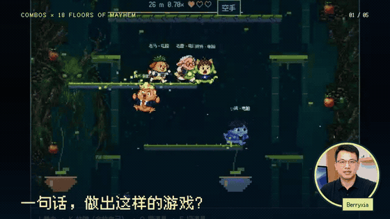
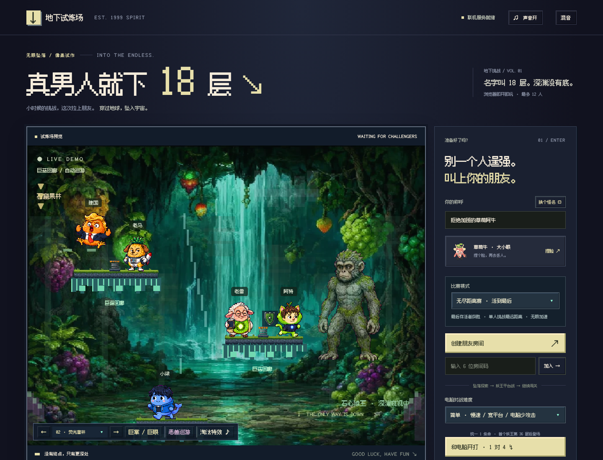
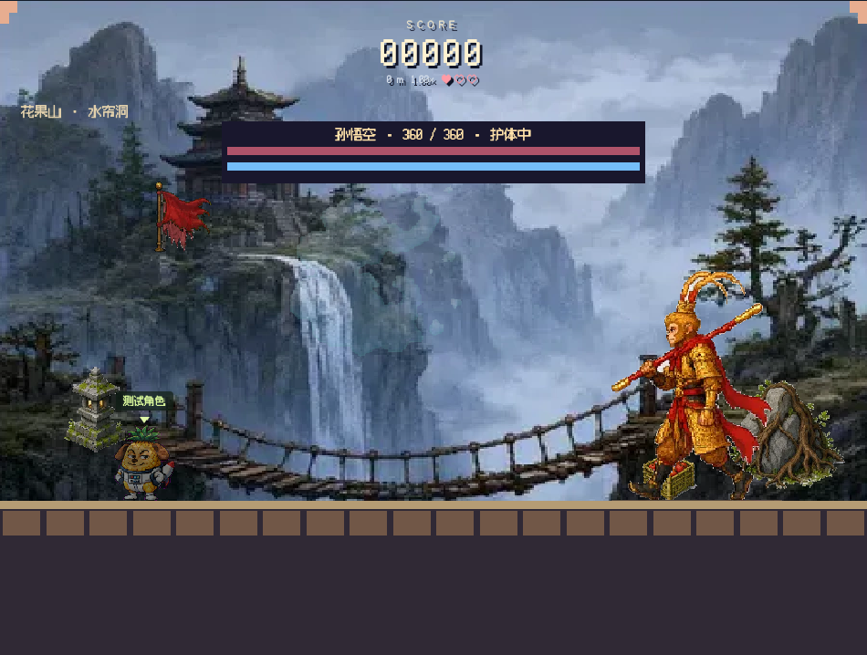

# 真男人就下 18 层 / 18 Floors of Mayhem

<a href="video/out/man18-story-berryxia-v5.mp4"></a>

**[▶ 观看完整制作与游玩视频（66 秒）](video/out/man18-story-berryxia-v5.mp4)** · **[🎮 在 Combos 上试玩](https://combos.game/play?post_id=09d6a46e602dfeffd3f77178a6091f8c)**

一个可在浏览器玩的复古像素下落游戏。从无底洞一路向下，拾取道具、躲开陷阱，在特定深度进入横版 Boss 战。支持单人、人机对战和好友联机；有角色选择、结算排行、称号海报与本地存档。

这个项目从“和朋友一起玩《是男人就下 100 层》”的想法开始，使用 Codex 和 [Combos CLI](https://combos.converge.ai/cli) 反复迭代。游戏可在 [Combos 上试玩](https://combos.game/play?post_id=09d6a46e602dfeffd3f77178a6091f8c)。

## 游戏画面与角色素材

| 首页：妖王待机与角色选择 | 横版 Boss 战：孙悟空平台战 |
| --- | --- |
|  |  |


动效预览截取自仓库内的最终成片；角色、场景、动作帧、音乐和音效素材可在 [`public/`](public/) 与 [`art-jobs/`](art-jobs/) 查看。

## 本地运行

需要 Node.js 22 或更新版本。

```sh
npm ci
npm start
```

打开 <http://localhost:3180/>。换端口可用 `PORT=8080 npm start`。本地联机时，朋友需要在同一个局域网中使用这台电脑的局域网地址；`localhost` 只能在本机访问。

```sh
npm test
```

## 操作与模式

- `A` / `D` 或方向键移动；`W`、上箭头或空格跳跃；`S` / 下箭头穿过平台。手机端使用屏幕虚拟按键。
- 下落阶段需要持续寻找落点，陷阱、道具和其他玩家会影响路线。每个角色开局只有一格生命。
- Boss 阶段切换到横版战斗平台，可使用轻重攻击、投掷与角色专属技能。
- 可单人挑战、与 AI 对手比赛，或创建房间邀请朋友联机。淘汰后可查看本局结果，部分模式支持观战。
- 进度保存在本机浏览器；更换设备或清除浏览器数据不会自动同步存档。

目前的“八十一难”是持续扩展中的关卡主题，仓库和游戏都不声称已完成全部 81 关。详细机制与开发记录见 [开发历史](docs/DEVELOPMENT_HISTORY.md)。

## 项目结构

| 目录 | 内容 |
| --- | --- |
| `public/` | 游戏前端、像素素材、音乐、音效与字体 |
| `shared/` | 本地服务器与云端 Worker 共用的房间规则 |
| `server.js` | 本地 HTTP 与 WebSocket 服务器 |
| `worker/` | Combos 云端多人房间后端 |
| `test/` | Node.js 游戏与联机回归测试 |
| `tools/` | Combos H5 构建与素材切图工具 |
| `art-jobs/` | Combos 素材生成的提示词、任务输入与原始素材 |
| `video/` | Remotion 剪辑工程、所需视频与音频素材、最终成片 |

发布到 Combos 时需使用你自己的 CLI 登录、Worker 与 Post 绑定。账号绑定文件 `combos.json` 与本地环境变量不在仓库中；`node tools/build-combos.mjs` 在已有有效 `combos.json` 的环境中构建 `dist/`。

视频成片在 [`video/out/man18-story-berryxia-v5.mp4`](video/out/man18-story-berryxia-v5.mp4)，剪辑源码与所需素材在 `video/src/`、`video/public/`、`video/raw/`。进入 `video/` 运行 `npm ci` 后，可用 `npm run render:berryxia-ending-final` 重新渲染。中间试剪、预览帧和 `node_modules` 未纳入版本库。

## 授权与素材

源码按 [MIT License](LICENSE) 开放。**图片、角色、音乐、音效、字体和真人出镜视频不自动适用 MIT**：第三方和生成素材的来源与授权说明见 [ASSET_CREDITS.md](ASSET_CREDITS.md)，字体的 OFL 许可见 `public/fonts/LICENSE.txt`。视频素材仅供查看和复现本项目；如要在其他项目中复用素材，请分别核对相应授权条款。
